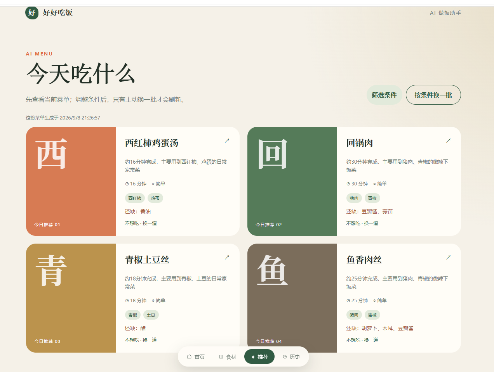
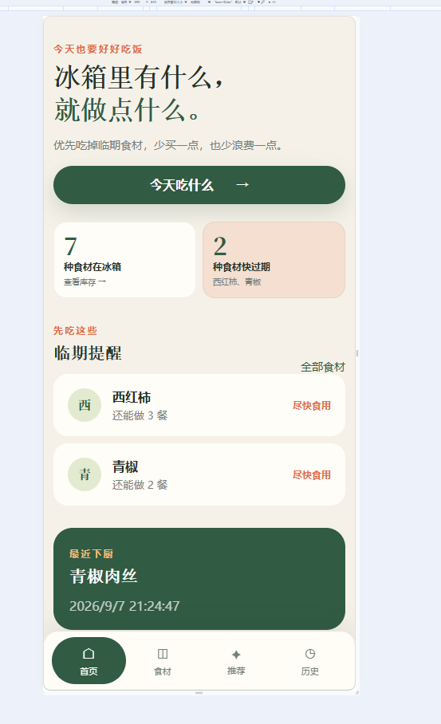
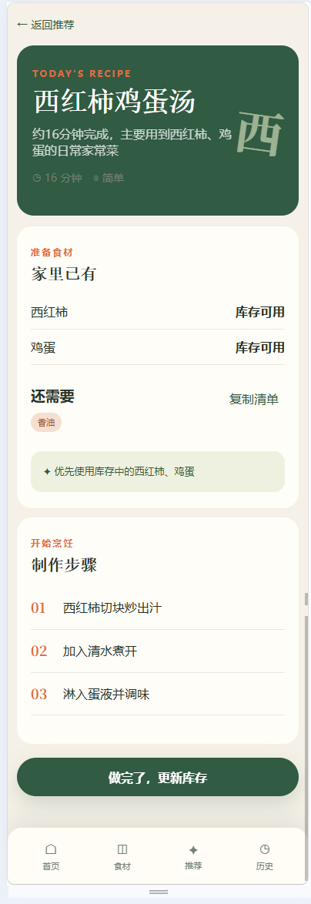
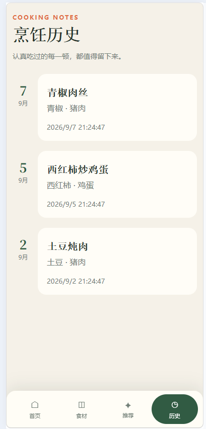
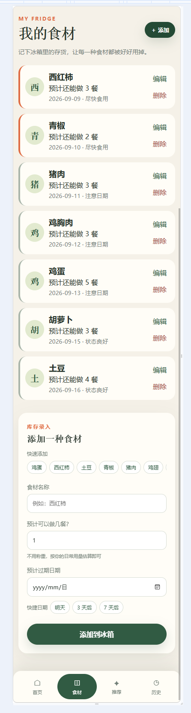
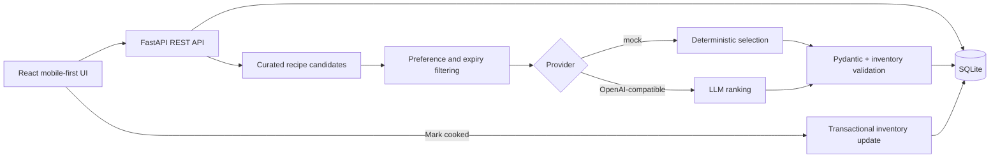

# PantryFlow — Cook what you have. Waste less.

> Turn what is already in your fridge into practical Chinese home-cooked meals — before good food goes to waste.

[](https://github.com/zhli3424-prog/pantryflow/actions/workflows/ci.yml)


[](LICENSE)

[中文文档](README.zh-CN.md) · [Quick start](#quick-start) · [Deploy](DEPLOYMENT.md) · [Architecture](#architecture) · [Roadmap](#roadmap)

PantryFlow is a mobile-first AI cooking assistant for the everyday question: **“I have ingredients, but what can I cook?”** It tracks pantry items as estimated meals instead of unreliable gram-level measurements, prioritizes ingredients close to expiry, recommends realistic dishes with minimal extra shopping, and updates inventory after cooking.

Unlike a thin recipe chatbot, PantryFlow combines a curated home-cooking catalog, optional LLM ranking, structured-output validation, deterministic inventory checks, persisted recommendation batches, and idempotent cooking records.

## Why try it?

- 🥬 **Waste less:** expiry-aware ranking promotes ingredients that should be used first.
- 🍳 **Cook with what you have:** recipes favor current inventory and keep missing items to 0–3.
- ✅ **Trust the output:** the model can select only approved, validated household recipes.
- 📱 **Use it in the kitchen:** compact mobile UI, saved menus, one-dish replacement, and history.
- 🔑 **Run without an API key:** deterministic demo mode works after installation.

## Product preview

<p align="center">
  
  <br><sub>Expiry-aware recommendations with single-dish replacement.</sub>
</p>

<p align="center">
  
  
  
  <br><sub>Pantry overview → recipe execution → cooking history</sub>
</p>

**Live Demo — Coming soon.**

## Features

- Pantry CRUD with estimated meal counts and optional expiry dates
- Expiry-aware ranking; expired ingredients are excluded
- Curated normal Chinese home-cooking candidates
- Cuisine, time, spice, equipment, and pantry-staple filters
- Recommendation batches that never refresh without the user's action
- Replace one dish without discarding the rest of the menu
- Ingredient alias normalization, such as `番茄 → 西红柿`
- Pydantic structured-output validation plus deterministic inventory checks
- Transactional, idempotent cooking completion and history
- Missing-ingredient list with one-tap copy
- Friendly API errors and a key-free provider for reproducible demos

<p align="center">
  
  <br><sub>Pantry management with meal counts and expiry dates.</sub>
</p>

## Demo flow

```text
Add ingredients → Generate a menu → Replace one dish → Follow the recipe
→ Mark it cooked → Decrease each used ingredient by one estimated meal
```

## Tech stack

| Layer | Technology |
|---|---|
| Frontend | React 19, TypeScript, Vite, React Router |
| Backend | FastAPI, SQLAlchemy 2, Pydantic 2 |
| Database | SQLite |
| AI | OpenAI Python SDK; OpenAI-compatible Chat Completions API |
| Quality | pytest, TypeScript compiler, Vite build, GitHub Actions |

## Architecture



The LLM stays inside a narrow decision boundary: it ranks approved candidates but cannot invent inventory, mutate the database, or bypass validation.

## Project structure

```text
.
├── .github/workflows/ci.yml       # Backend and frontend CI
├── backend/
│   ├── app/
│   │   ├── models/                # SQLAlchemy entities
│   │   ├── routers/               # REST endpoints
│   │   ├── schemas/               # API and AI contracts
│   │   └── services/              # AI, recommendation, inventory rules
│   ├── tests/                     # API workflow tests
│   ├── requirements.txt           # Runtime dependencies
│   └── requirements-dev.txt       # Test dependencies
├── frontend/src/                  # React application
├── docs/screenshots/              # Screenshot and GIF checklist
├── setup.ps1                      # One-command Windows setup
└── start.ps1                      # One-command local launch
```

## Quick start

Prerequisites: Python 3.12+ and [Bun](https://bun.sh/).

```powershell
git clone https://github.com/zhli3424-prog/pantryflow.git
cd pantryflow
.\setup.ps1
.\start.ps1
```

Open <http://localhost:5173>. API docs are at <http://localhost:8000/docs>. Close the two server windows to stop the app.

### Manual setup

```powershell
# Backend
cd backend
py -3.12 -m venv .venv
.\.venv\Scripts\python.exe -m pip install -r requirements-dev.txt
Copy-Item .env.example .env
.\start.ps1

# Frontend, in another terminal
cd frontend
bun install --frozen-lockfile
Copy-Item .env.example .env
.\start.ps1
```

### View on a phone

Connect the phone and computer to the same Wi-Fi, find the computer's IPv4 address with `ipconfig`, and open `http://YOUR_COMPUTER_IP:5173`. Allow Bun/Node access to private networks if Windows asks.

## Environment variables

Demo mode requires no API key:

```dotenv
# backend/.env
APP_ENV=development
DATABASE_URL=sqlite:///./data/cooking_assistant.db
CORS_ORIGINS=http://localhost:5173
AI_PROVIDER=mock
AI_BASE_URL=https://api.openai.com/v1
AI_API_KEY=
AI_MODEL=gpt-4o-mini
AI_TIMEOUT_SECONDS=30
DEMO_SEED_ON_EMPTY=false
```

For an OpenAI-compatible service, set `AI_PROVIDER=openai_compatible` and configure the base URL, key, and model. Never commit a real `.env` file or secret.

## Usage example

1. Add `鸡蛋`, `西红柿`, `土豆`, `青椒`, and `猪肉` with estimated meal counts.
2. Add optional expiry dates and select staples such as oil, salt, soy sauce, ginger, or garlic.
3. Generate today's menu, keep it, replace one dish, or request a new filtered batch.
4. Open a recipe and tap **Done** after cooking. Every used pantry item loses one estimated meal.

## Core implementation

### Reliable AI workflow

1. Load non-expired inventory and sort it by expiry urgency.
2. Build plausible candidates from a controlled home-cooking catalog.
3. Apply user filters and disliked-dish history.
4. Let the configured provider select and rank approved candidates.
5. Validate JSON with Pydantic and re-check inventory in backend code.
6. Persist the batch and its inventory signature.

### Stable and safe state

Menus are restored after refresh. Inventory changes produce a warning instead of silently replacing the menu. Cooking completion runs in one transaction, while a unique recommendation reference prevents double deduction on repeated requests.

## API overview

| Method | Endpoint | Purpose |
|---|---|---|
| GET | `/api/v1/health` | Health check |
| GET / POST | `/api/v1/ingredients` | List or add pantry items |
| GET / PATCH / DELETE | `/api/v1/ingredients/{id}` | Read, edit, or remove an item |
| POST | `/api/v1/recommendations` | Generate and persist a menu |
| GET | `/api/v1/recommendations/latest` | Restore the latest menu |
| POST | `/api/v1/recommendations/{id}/replace` | Replace one dish |
| POST | `/api/v1/recommendations/{id}/cook` | Complete cooking and update inventory |
| GET | `/api/v1/history` | List cooking history |

## Tests

```powershell
cd backend
.\.venv\Scripts\python.exe -m pytest -q -p no:cacheprovider

cd ..\frontend
bun run build
```

Tests cover pantry CRUD, aliases, expiry exclusion, filters, menu rotation, batch persistence, meal-count deduction, and duplicate-submission protection.

## Roadmap

- [ ] Improve variety across dishes in the same batch
- [ ] Add cooking-step checkboxes and an undo action
- [ ] Publish a hosted demo, real screenshots, and a short GIF
- [ ] Add an installable PWA shell for kitchen use
- [ ] Evaluate photo-assisted ingredient entry after validating the core workflow

Docker, authentication, nutrition analysis, vector search, and multi-agent orchestration are intentionally excluded until deployment or validated user needs justify them.

## Scope and limitations

- Demo mode is deterministic and does not represent live-model quality.
- Expiry dates are prioritization hints, not food-safety guarantees.
- Estimated meal counts trade precision for low-friction household use.
- The current build targets a local, single-user environment.

## Contributing

Issues and focused pull requests are welcome. Read [CONTRIBUTING.md](CONTRIBUTING.md) before contributing.

## License

Released under the [MIT License](LICENSE).
