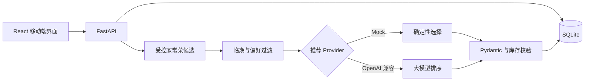

# PantryFlow — Cook what you have. Waste less.

> 把冰箱里已有的食材，变成真正做得出来的家常菜，并优先吃掉快过期的食物。

[English](README.md) · [快速开始](#快速开始) · [部署说明](DEPLOYMENT.md) · [系统架构](#系统架构) · [后续规划](#后续规划)

PantryFlow 是一个移动端优先的 AI 做饭助手，解决“家里有菜，却不知道做什么”的问题。它不要求用户精确称重，而是用“预计还能做几餐”管理库存；系统结合过期日期、现有食材和筛选条件推荐日常菜，做完后自动更新库存并保存历史。

它不是简单的菜谱聊天页面：项目把受控家常菜候选库、可选的大模型排序、结构化输出校验、后端库存规则、推荐批次持久化和幂等扣减连成了完整业务闭环。

## 核心功能

- 按预计餐数管理食材，支持增删改查与过期日期
- 临期食材优先，过期食材不参与推荐
- 菜系、用时、辣度、厨具和常备调料筛选
- 推荐结果持久化，刷新页面不会变化
- 只替换一道不想吃的菜，其余菜单保持不变
- “番茄/西红柿”等常见食材别名归一
- Pydantic 校验 AI JSON，后端再次检查库存关系
- 做完后每种使用食材减 1 餐，重复点击不会重复扣减
- 烹饪历史、缺少食材和购物清单复制
- 默认 Demo 模式无需 API Key，可稳定复现

## 演示流程

```text
添加食材 → 生成今日菜单 → 换掉一道菜 → 查看步骤
→ 点击做完 → 更新剩余餐数 → 保存烹饪历史
```

发布前请按 [截图清单](docs/screenshots/README.md) 添加真实截图和 20～40 秒 GIF，注意隐藏 IP、通知和其他隐私信息。

## 技术栈

| 层级 | 技术 |
|---|---|
| 前端 | React 19、TypeScript、Vite、React Router |
| 后端 | FastAPI、SQLAlchemy 2、Pydantic 2 |
| 数据库 | SQLite |
| AI | OpenAI Python SDK、OpenAI 兼容接口 |
| 工程化 | pytest、Vite Build、GitHub Actions、PowerShell 脚本 |

## 系统架构



大模型只负责从合格候选中选择和排序，不能直接编造库存、修改数据库或绕过后端校验。

## 快速开始

需要 Python 3.12+ 和 [Bun](https://bun.sh/)。

```powershell
git clone <仓库地址>
cd pantryflow
.\setup.ps1
.\start.ps1
```

打开 <http://127.0.0.1:5173>，API 文档位于 <http://127.0.0.1:8000/docs>。默认使用 `AI_PROVIDER=mock`，无需 API Key。

连接真实 OpenAI 兼容模型时，复制 `backend/.env.example` 为 `backend/.env`，并配置：

```dotenv
AI_PROVIDER=openai_compatible
AI_BASE_URL=https://api.openai.com/v1
AI_API_KEY=
AI_MODEL=gpt-4o-mini
```

真实 `.env`、API Key、本地数据库和构建产物均不会提交。

## 手机查看

手机和电脑连接同一 Wi-Fi，运行 `ipconfig` 查找电脑 IPv4 地址，然后打开 `http://电脑IP:5173`。

## 测试

```powershell
cd backend
.\.venv\Scripts\python.exe -m pytest -q -p no:cacheprovider

cd ..\frontend
bun run build
```

## 核心实现

推荐请求依次经过可用库存加载、临期排序、合理候选生成、偏好过滤、Provider 选择、Pydantic 校验、库存二次校验和批次保存。库存变化只显示提醒，不覆盖用户正在查看的菜单。

完成烹饪使用数据库事务；历史记录中的推荐 ID 具有唯一约束，因此重复请求不会重复扣减。

## 后续规划

- [ ] 改善同一批菜单的菜品多样性
- [ ] 增加步骤勾选和完成后的撤销操作
- [ ] 补充公开 Demo、真实截图和演示 GIF
- [ ] 增加可安装的 PWA 外壳
- [ ] 核心流程验证后再评估拍照录入

Docker、用户系统、营养分析、向量数据库和多 Agent 暂不加入，避免为了复杂而复杂。

## 项目边界

- Demo Provider 是可复现的模拟推荐，不代表线上模型效果。
- 过期日期仅用于排序提醒，不能替代食品安全判断。
- 预计餐数强调低操作成本，不保证精确消耗。
- 当前适合本地单用户使用与作品演示。

## 参与贡献与许可证

欢迎提交 Issue 和聚焦的 Pull Request。请先阅读 [CONTRIBUTING.md](CONTRIBUTING.md)。项目使用 [MIT License](LICENSE)。
